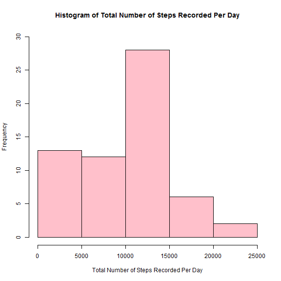
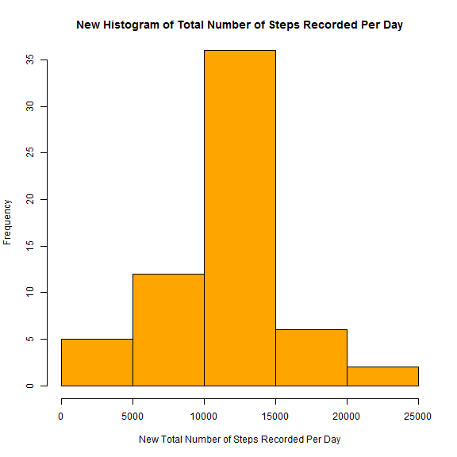
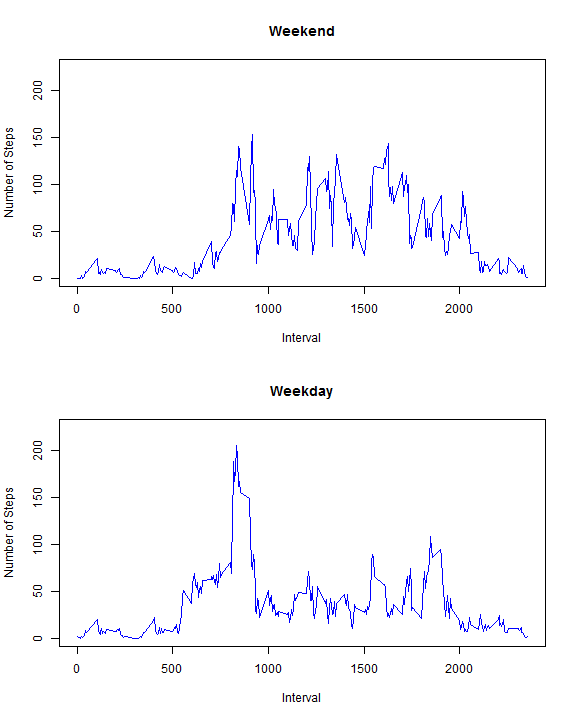

# Loading and preprocessing the data
After unziping the folder, load the "activity.csv" file using the following code:

```r
data <- read.csv("activity.csv")
```


# What is the mean total number of steps taken per day?
Ignoring NA values, calculate the total number of steps taken per day, and create a histogram using:

```r
datasep <- split(data, data$date)
totalpd <- sapply(datasep, function(x) sum(x[,"steps"], na.rm=TRUE))
hist(totalpd, col="pink", main="Histogram of Total Number of Steps Recorded Per Day",
     xlab="Total Number of Steps Recorded Per Day", ylim=c(0,30))
```

 

Calculate the mean total number of steps taken per day using:

```r
meansteps <- mean(totalpd, na.rm=TRUE)
meansteps
```

```
## [1] 9354.23
```
The mean total number of steps is: 9354.23

Calculate the median total number of steps taken per day using:

```r
mediansteps <- median(totalpd, na.rm=TRUE)
mediansteps
```

```
## [1] 10395
```
The median total number of steps is: 10395

# What is the average daily activity pattern?
Create a plot of the average number of steps over all days taken per five minute interval using:

```r
intervalsep <- split(data, data$interval)
averagepi <- lapply (intervalsep, function(y) mean(y[,"steps"], na.rm=TRUE))
##averagepi returns a list of means number of steps for each interval
averageresults <- ldply(averagepi)
##coerced the list created from lapply back into a dataframe in order create a plot
colnames(averageresults) <- c("Interval", "Average")
plot(averageresults, type="l", main="Average Number of Steps per Interval Over All Days",
     xlab="Interval", ylab="Average Number of Steps", col="red")
```

 

The interval that contains the maximum average number of steps taken can be found using: 

```r
rownumber <- which.max(averageresults$Average)
##rownumber returns 104, so the row that contains the maximum average and corresponding interval is row 104
maxaverage <- averageresults[104,]
maxaverage
```

```
##     Interval  Average
## 104      835 206.1698
```
The interval that contains the maximum average number of steps taken is: 835

# Imputing missing values
Calculate the number of NA values using:

```r
intervalsep <- split(data, data$interval)
intervalframe <- ldply(intervalsep)
napresent <- is.na(intervalframe)
naresults <- length(napresent[napresent==TRUE])
naresults
```

```
## [1] 2304
```
The number of NA values present in the data is: 2304

Fill NA values with mean values for their corresponding 5 minute interval using:

```r
newintervalframe <- intervalframe
newintervalframe[is.na(newintervalframe)] <- averageresults$Average
```

Create a new dataset equal to the original set, but with the missing values filled in using:

```r
newdatadraft <- split(newintervalframe, newintervalframe$date)
newdatafinal <- ldply(newdatadraft)
```

With the new data values, calculate the total number of steps taken per day, and create a histogram using:

```r
newdatasep <- split(newdatafinal, newdatafinal$date)
newtotalpd <- sapply(newdatasep, function(z) sum(z[,"steps"]))
hist(newtotalpd, col="orange", main="New Histogram of Total Number of Steps Recorded Per Day",
     xlab="New Total Number of Steps Recorded Per Day", ylim=c(0,35))
```

 

With the new data values, calculate the mean total number of steps taken per day using:

```r
newmeansteps <- mean(newtotalpd)
meansteps
```

```
## [1] 9354.23
```
The new mean total number of steps taken per day is: 10766.19

Calculate the new median total number of steps taken per day using:

```r
newmediansteps <- median(newtotalpd)
mediansteps
```

```
## [1] 10395
```
The new median total number of steps taken per day is: 10761.51

The new median value is slightly greater than the original median value, whereas the new mean value is significantly greater than the original mean amount. Both new values support the idea that the impact of imputing missing data may potentially increase original estimates.

# Are there differences in activity patterns between weekdays and weekends?
Create a new factor variable in the dataset with levels "weekday" and "weekend" using:

```r
formatteddate <- as.POSIXlt(newintervalframe$date)
dayofweek <- weekdays(formatteddate, abbreviate=TRUE)
finalintervalframe <- cbind(newintervalframe, dayofweek)
```

Create a plot of the average number of steps taken in the 5 minute intervals, averaged across all weekday days and weekend days using:

```r
weekdayorweekend <- ifelse(finalintervalframe$dayofweek %in% c("Mon", "Tue", "Wed", "Thu",
                                                                 "Fri"), "weekday", "weekend")
finalintervalframe$dayofweek<- weekdayorweekend
dayseparation <- split(finalintervalframe, finalintervalframe$dayofweek)
    ##finalintervalframe split by weekdays and weekends
weekdayonly <- dayseparation$weekday
weekendonly <- dayseparation$weekend
weekdaysplit <- split(weekdayonly, weekdayonly$interval)
weekendsplit <- split(weekendonly, weekendonly$interval)
    ##separated weekdays and weekends into lists by 5 minute intervals (0:2355 minutes)
averageweekday <- lapply(weekdaysplit, function(d) mean(d[,"steps"]))
averageweekend <- lapply(weekendsplit, function(e) mean(e[,"steps"]))
weekdayresults <- ldply(averageweekday)
weekendresults <- ldply(averageweekend)
    ##coerced lists into dataframes in order to plot
finalweekdayresults <- as.numeric(weekdayresults$Interval)
finalweekendresults <- as.numeric(weekendresults$Interval)
    ##coerced Invterval column for both dataframes into numeric (originally "character" class)
colnames(weekdayresults) <- c("Interval", "Average")
colnames(weekendresults) <- c("Interval", "Average")

par(mfrow=c(2,1))
plot(weekendresults$Interval, weekendresults$Average, type="l", col="blue", main="Weekend",
     xlab="Interval", ylab="Number of Steps", ylim=c(0, 225))
plot(weekdayresults$Interval, weekdayresults$Average, type="l",col="blue", main="Weekday",
     xlab="Interval", ylab="Number of Steps", ylim=c(0, 225))
```

 
